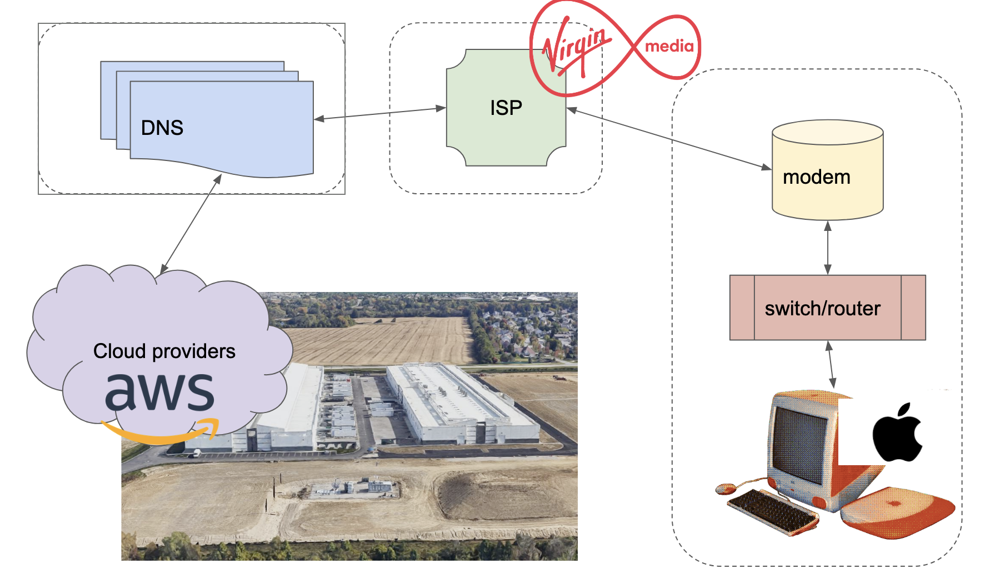

# Section 1. What is the internet

The internet as we know it now is a complex and sprawling system, built over decades, with janky layers of protocols, software, hardware and shifting power dynamics. If you were to slim it down to the bear basics though, it might look something like this

A web server is a computer with some data or content on it that is open to the public on an IP address (which looks something like 198.51.100.1)

A Domain Name Server (DNS) is another computer that resolved human readable addresses like www.example.com to those IP addresses of the servers

A Modem provides your connection to your Internet Service Provider, and wider internet traffic that the Router then directs.

A Router is like the traffic conductor of data flowing through the internet, your home one connects your local network to the wider internet, and service providers have larger and more complicated ones.

When you make a call to a website from a device in your home, it goes through a router, modem and then is directed to the web server, which can then send a response back. 

[2. How to DIY a Network](./2_DIY_network.md)
[3. More reading](./3_more_reading.md)