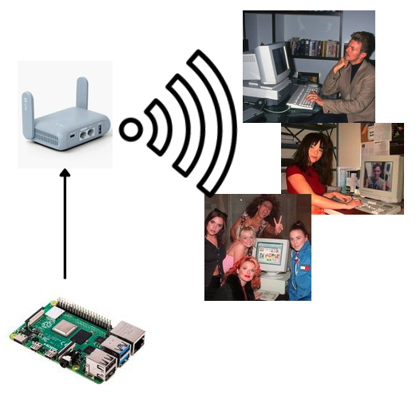

# Section 2. A DIY network

We don’t need global infrastructure to make something like this happen in our home or community. There are some great libraries to look at like LoRa, Meshtastic and Reticulum, but for this example I’ve used a plain old travel router with Wifi and a web server running on a Raspberry Pi.

This is heavily cribbed from the fantastic Hydroponic Trash newsletter, with some changes that I needed to get it working or felt simplified the process. Check out their blog here for more amazing resource, and how to make the network we are about to build solar powered or scaled to a whole city service!

https://blog.hydroponictrash.solar/offgridinternet/ 



In this setup - your Raspberry Pi is going to act like a **server**. It will host a website using a minimal-coding blog library called Hugo. It could also host other things like:

- A free library of PDFs
- Photos and videos
- An instant messaging server

We’ll use a regular travel or home modem/router to act both as a modem and router, as well as to provide a DNS  and a Captive Portal functionality.

This means that when our users connect to our wifi, they won’t be connected to the wider internet but instead our own little ecosystem on the Raspberry Pi server. It could be described as a Local Area Network (LAN)

You could scale this by having many servers attached to the same network, as well as many antennas/nodes/routers to boost the initial signal of the network.

## What you’ll need

- Raspberry Pi - I used an old 3B
- Good power cable for the Pi - like the official Raspberry Pi one
- SD card for the Pi
- Travel Router or regular Router - I used a GL.iNet travel one.
- A computer with a screen and keyboard for easy editing of files
- Access to Wifi or 3G hotspot
Optional:
- Ethernet cable to connect the Pi to your home modem. I just find this an easier way to switch between the actual internet and your local wifi network.

## Setting up the Pi

I used DietPi as the operating system for my Raspberry Pi.

https://dietpi.com/docs/install/

Follow their official documentation on how to flash your SD card. 

But note that you want to add wifi! There’s a drop down menu to expand on their site that has this info.

Once you’ve flashed the sd card, open it from your computer and do the following:

- Open the file named dietpi.txt. Find AUTO_SETUP_NET_WIFI_ENABLED and set to value 1.
- Open the file dietpi-wifi.txt and set aWIFI_SSID[0] to the name of your WiFi network.
- In the same file dietpi-wifi.txt, set aWIFI_KEY[0] to the password of your WiFi network.
- Save and close the files

Once you've put the SD card in the Pi and turned it on, it should then connect to wifi on boot.
You'll want to access the Pi via `ssh` from your terminal. E.g. `ssh root@192.168.1.20`.

**Note: if you’re having trouble finding your pi’s IP address, you could perhaps look at the connected devices on your network via your internet router or download a software called nmap to help look at the IPs on your network. (If there are a few without host names, keep trying until you get the right one!) Mac users can also run the command `arp -a` to see a list of devices connected - find the ones with a MAC address (looks something like “A8:23:BC:45:D1:3E”) and try their IP addresses.**

## Setup your Hugo server

The Raspberry Pi is going to be our server. You could install almost anything you like on this - a chat server, video library, book library etc. For this experiment we’re going to serve up a simple website.  

We’ll use Hugo to do this. This process is mostly cribbed from the Hydroponic trash blog https://blog.hydroponictrash.solar/offgridinternet/ with a few changes at the end. 

**Note: I did the hugo project setup on my regular laptop and IDE, and created a github repo that I then cloned on my server, or you can do directly on the server’s command line as below.**

```bash
sudo apt-get install hugo
```

Navigate to a directory you want the server info to live in. I just put it in the root directory.

```bash
hugo new site offgridserver
```

Change that last part to whatever you want, that is what the directory will be called, and it will auto-populate all the server info into there.

```bash
cd offgridserver
git init
git submodule add https://github.com/theNewDynamic/gohugo-theme-ananke.git themes/ananke
```

So here you will choose a theme, you can use the one above or find more here:
https://themes.gohugo.io/. These themes are used as git submodules which can be a bit tricky to understand - basically they are separate git projects within the parent git project. 

Next, you will edit your main config file. That should be in your Hugo server directory called `config.toml`.

```bash
nano config.toml
```

```text
baseURL = 'http://example.org/'
languageCode = 'en-us'
title = 'Community Emergency Server'
theme = 'ananke'
```

Change the title of the server; this will be displayed, so change it to something legit. Then add the name of your theme. If you don’t know the proper name, look in your Hugo directory. /home/youruser/offgridserver/themes obviously change that info to how your directories are.

Next, make a post!

```bash
hugo new posts/welcome.
```

That will create a markdown file in `/home/youruser/offgridserver/content/posts`

```bash
nano welcome.md
```

```markdown
---
title: "About This Server"
date: 2019-03-26T08:47:11+01:00
draft: false
---

This server was created to help people connect with each other.

Look out for eachother, and remember that we get though this together! Not alone!

```

So this all works in markdown and requires no coding on your end, so most people can quickly start a basic webserver no problem and let Hugo handle everything else.

Next, start the Hugo server. It should run on http://localhost:1313 -

```bash
hugo server
```

## Making Hugo start at boot and bind to an IP address

We are going to make a custom service for Hugo.

```bash
sudo nano /etc/systemd/system/hugo.service
```

```markdown
[Unit]
Description=(Runs Hugo Server on Boot)

[Service]
WorkingDirectory=/home/youruser/offgridserver
ExecStart=/usr/bin/hugo server --bind 0.0.0.0 --port 8080 --baseURL http://192.168.8.146/

[Install]
WantedBy=multi-user.target
```

Here we’ve told the server to run on port 80 - that’s the port that is for regular web requests, so putting the IP address into the browser will serve the website without the need for a port.

Change the working directory to the correct one and the IP to your correct IP address. (This will be the current IP address of the pi connected to the wifi network, that you are using to ssh into)

Then exit and save the file.

```bash
sudo systemctl daemon-reload
```

When you make changes to configuration files, you need to run that to tell the machine to reload your configs.

```bash
sudo systemctl start hugo.service
```

Make the server start at boot

```bash
sudo systemctl enable hugo.service
```

Hugo throws errors with actual descriptions, so if you have problems, you will know about it. If your server has errors, it won’t run. See what the error says by running this command to show the tool's output.

```bash
sudo systemctl status hugo.service
```

## Setup the router

When you plug your router in, it should serve up its own wifi connection and you can access its admin panel by following your router provided network. You can then use the admin panel to connect to your home network so we can get some some of the actual Internet to download the libraries we will need.

### Change wifi settings on router

Change the name of the wifi you’d like to provide and the password you’d like to set, or create a guest network with no password.

### Setup DNS redirects

In order to tell connected devices where to go, because our network won’t have access to the wider internet we want to create our own little address book that points every address to your own server.

1. SSH into router
1. Install dnsmasq
1. vim /etc/dnsmasq.conf
    - How to edit in vim: Press the ‘i’ key
1. Type “address=/#/192.168.9.208” at top of file
1. Press the ‘esc’ key (to exist edit mode in vim)
1. Type `:wq` to save the file
1. Run `service dnsmasq reload` and `service dnsmasq restart` in terminal

## Setup nodogsplash

I found it difficult to find a recent travel router that supplied its own captive portal tech, so I used a library called `nodogsplash` to serve one.

1. SSH into router
1. Install nodogsplash 
1. `vim /etc/config/nodogsplash`
1. My file looks like this:

    ```text

    config nodogsplash
        option gatewayinterface 'br-lan'
        option gatewayname 'Dreamnet Captive Portal'
        option maxclients '500'
        list fw_mark_authenticated '30000'
        list fw_mark_trusted '20000'
        list fw_mark_blocked '10000'
        option authidletimeout '2'
        option preauthtimeout '1'
        option redirecturl 'http://ip.address/'
        list preauthenticated_users 'allow tcp port 53'
        list preauthenticated_users 'allow udp port 53'
        list users_to_router 'allow tcp port 53'
        list users_to_router 'allow udp port 53'
        list users_to_router 'allow udp port 67'
        list authenticated_users 'allow all'
        option enabled '1'
    ```

    Replace the ip.address with your Pi's IP address on the new router's network.
1. exit and save file
1. `/etc/init.d/nodogsplash reload` and `/etc/init.d/nodogsplash restart`

### Customise splash screen

Nodogsplash will serve a simple HTML screen from /etc/nodogsplash/htdoc/splash.html  
you can edit it from the terminal, and make sure the button redirects to the IP of your Pi, or create a file on your computer and then copy it to the router via an scp command

```bash
scp -O root@{ip.of.router}:/etc/nodogsplash/htdoc/splash.html path/to/your/htmlfile 
```

## Connect your server to your router

### Update wifi in dietpi

```bash
dietpi-config
```

running the above opens the UI for editing dietpi config. From there select Network Options: Adapters > Select WiFi
You can manually add your wifi networks and optional passwords.
Add your new router's info as the first one and delete the old wifi info, or else it will try to connect to that. 

**Note: This can be a bit tricky, because if the Pi loses a wifi connection you can't access it via ssh again - that's where an ethernet cable comes in handy. You also need to be on the same wifi network as the pi to ssh into it.**

### Assign static IP address in router

From the admin panel for your router you should be able to assign static IP's to connected devices. Find the Pi in the list and the IP connected to it and make a note of it, as it will be different to the one assigned by your other wifi.

### Update IP address on the hugo server

With changes to static IP addresses, come changes to config files.
The Pi's IP has changed as its connecting to a new network, so we have to edit the Hugo config to point to the right IP!

```bash
sudo nano /etc/systemd/system/hugo.
```

```markdown
[Unit]
Description=(Runs Hugo Server on Boot)

[Service]
WorkingDirectory=/home/youruser/offgridserver
ExecStart=/usr/bin/hugo server --bind 0.0.0.0 --baseURL http://192.168.9.147/

[Install]
WantedBy=multi-user.
```

```bash
sudo systemctl stop hugo.service
sudo systemctl daemon-reload
sudo systemctl start hugo.service
```

Restart your server after confirming a few things:

* Your server is set to automatically connect to the correct wifi, all other wifi networks are disabled from automatically connecting or forgotten.
* Your services are all set to automatically start, reboot your server and navigate to them to see if they work automatically. If not go back and check if you enabled them.
  
Then you can reboot the server, then use another computer or your phone to connect to your new guest wifi and see if the captive portal brings you to your hugo landing page.

And you've done it! Users who connect to your wifi should now be served our lovely website, or if they try to navigate to a site it should redirect to the one you've created.
